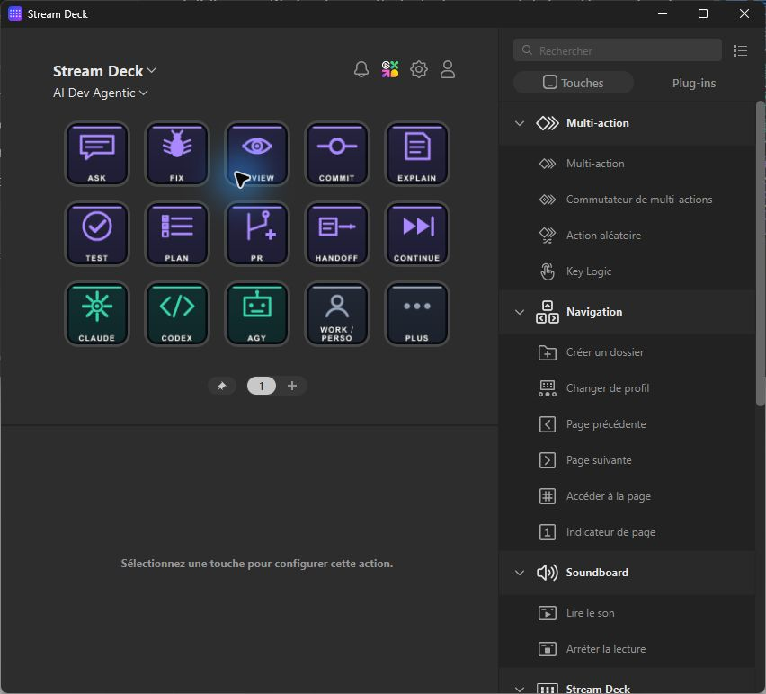

<div align="center">

# AI Dev Stream Deck

### Press a key. Your agent is already working.

Turn an Elgato Stream Deck into an AI-first development cockpit for Windows. Capture the current project, selection, clipboard and Git state, then start Claude Code, Codex or AGY directly in a terminal with the task already in progress.

[](https://github.com/JacquesGariepy/ai-dev-stream-deck/actions/workflows/tests.yml)


[](LICENSE)



**No control panel between the key and the work. No launcher API key. No bundled orchestrator.**

[Install](#install) · [Meet the deck](#the-15-key-agent-loop) · [Customize](#make-it-yours) · [Classic cockpit](#classic-cockpit-optional)

</div>

---

## One press starts the whole loop

The Agentic profile is a thin local control surface. A key either performs a native action or invokes one small PowerShell dispatcher. The dispatcher resolves the project open in VS Code, Cursor, Windsurf or VSCodium, captures useful context and opens Windows Terminal with the selected harness and account profile.

There is no Python UI in the path:

```text
Stream Deck key
    → hidden ai.ps1 dispatcher
    → current project + selection + clipboard + Git context
    → claude-work / codex-personal / agy-work
    → visible terminal session you can continue
```

Your agents use their normal local configuration, MCP servers, skills and authentication. The deck does not proxy prompts, store credentials or replace the agent runtime.

## The 15-key agent loop

| ASK | FIX | REVIEW | COMMIT | EXPLAIN |
|---|---|---|---|---|
| TEST | PLAN | PR | HANDOFF | CONTINUE |
| CLAUDE | CODEX | AGY | WORK / PERSO | PLUS |

- **ASK** accepts an objective, including Windows voice dictation with `Win + H`.
- **FIX** uses selected text or the clipboard, reproduces the problem, fixes it and runs focused checks.
- **REVIEW** inspects the current diff and repairs concrete defects.
- **COMMIT** checks the tree and creates logical commits. It never pushes.
- **EXPLAIN** explains the current selection in read-only mode.
- **TEST** runs the project suite, fixes failures and re-runs it.
- **PLAN**, **PR** and **HANDOFF** inspect the repository without editing it.
- **CONTINUE** resumes the last harness in the current project.
- **CLAUDE**, **CODEX** and **AGY** open an interactive session immediately.
- **WORK / PERSO** switches the account wrapper used by every agent key.
- **PLUS** opens direct Git, editor, debug, media, desktop, Windows and web controls.

Autonomous keys may edit files, run commands and create commits. Agent-side guardrails prohibit push, force-push, remote merges and publishing. The direct **PUSH** key remains visible and requires confirmation in its terminal.

## Install

### Requirements

- Windows 10 or 11
- Python 3.11+
- PowerShell 7 recommended; Windows PowerShell 5.1 is supported by the dispatcher
- Elgato Stream Deck software
- At least one supported CLI: Claude Code, Codex or AGY

### Generate and import the Agentic profile

```powershell
git clone https://github.com/JacquesGariepy/ai-dev-stream-deck.git
cd ai-dev-stream-deck
python scripts/agent_deck.py
```

The generator detects the connected Stream Deck model, writes Windows-native shortcuts, audits every generated page and opens the resulting profile for import. Select **AI Dev Agentic** in the Stream Deck application.

Generated runtime files live under:

```text
%LOCALAPPDATA%\AI Dev\agentdeck
```

This short, stable path also avoids Windows path-length and packaged-app redirection problems.

### Account profiles

For each harness, the dispatcher first looks for the active named wrapper and falls back to the base CLI:

```text
claude-work       claude-personal
codex-work        codex-personal
agy-work          agy-personal
```

PowerShell functions and aliases are supported because terminal sessions load the normal user profile. A wrapper can forward arguments to any account-selection mechanism you already use:

```powershell
function claude-work { Invoke-AiProfile -Tool claude -ProfileName work -ToolArgs $args }
```

Press **WORK / PERSO** to switch all three harnesses together. If a named wrapper is unavailable, the deck runs `claude`, `codex` or `agy` directly.

## Context without copy-paste chores

Agent intents can receive:

- the project detected from the foreground editor;
- a manually selected fallback project;
- selected text or current clipboard content;
- the current Git branch, short status and diff summary;
- an English task prompt with local safety rules.

Clipboard context is capped before it reaches a harness. Repository text is explicitly treated as data rather than trusted instructions. Request files are temporary and deleted when the terminal session starts.

## Make it yours

Edit the installed `intents.json` to change harness assignments, autonomy modes, prompts, root folders or the default project. You do not need to regenerate the Stream Deck profile after editing it.

```text
%LOCALAPPDATA%\AI Dev\agentdeck\intents.json
```

The source template is [`agentdeck/intents.json`](agentdeck/intents.json). Human-facing controls can be localized; prompts sent to agents remain English so behavior stays consistent across machines.

The repository is generic and contains no Factory, OpenClaw, AX or other orchestrator. Use whichever harness or orchestration layer is installed on your workstation.

## Native tools behind PLUS

The secondary pages keep frequent operations out of an intermediate app:

- fixed Git status, diff, log, fetch and fast-forward pull commands;
- confirmed Git push;
- editor navigation, search, formatting and terminal shortcuts;
- debug controls;
- media and volume controls;
- virtual desktops, window management and screen capture;
- Windows utilities and web tools.

Web destinations use the browser selected by Windows. The optional Classic cockpit provides per-context Chrome, Edge, Firefox or Brave selection.

## Classic cockpit (optional)

The repository also includes the original dynamic AI Dev desktop application. It discovers more workstation tools, terminal types, desktop applications, project tasks and declared MCP configurations. Run it when you want a visual configuration and inventory surface:

```powershell
python launch.py
```

Generate its larger Expert profile with:

```powershell
python scripts/stream_deck.py --import-profile
```

The **AI Dev Agentic** profile does not call `launch.py`; its TEST, Git and agent keys never open the Classic control panel.

## Safety and privacy

- Source and generated workstation data are separated.
- Profile archives, device IDs, local inventories, missions and credentials are excluded from the public export.
- Agent keys never push or publish.
- The only direct push action asks for confirmation.
- No force-push, hard reset, branch deletion or automatic remote merge key exists.
- Discovery never claims that an installed command is authenticated.

## Development and verification

```powershell
python -m unittest discover -s tests -v
python scripts/agent_deck.py --no-import
python scripts/export_public.py ..\ai-dev-stream-deck-source.zip
```

The Windows generator validates the shortcuts through the native Windows Shell API. The profile auditor verifies navigation, action targets, page capacity and launcher files before import. Public CI runs the offline suite on Windows.

## Documentation

- [Complete Classic button map](docs/BUTTONS.md)
- [First-run behavior](docs/FIRST-RUN.md)
- [Engineering priorities](docs/ENGINEERING.md)
- [Contributing](CONTRIBUTING.md)
- [Security policy](SECURITY.md)

---

<div align="center">

Built for developers who want AI work to start at the speed of a keypress.

**Local-first. Agent-native. MIT licensed.**

</div>
