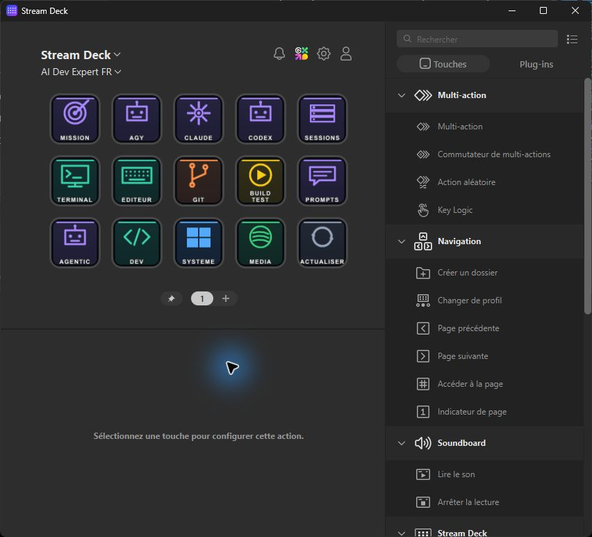
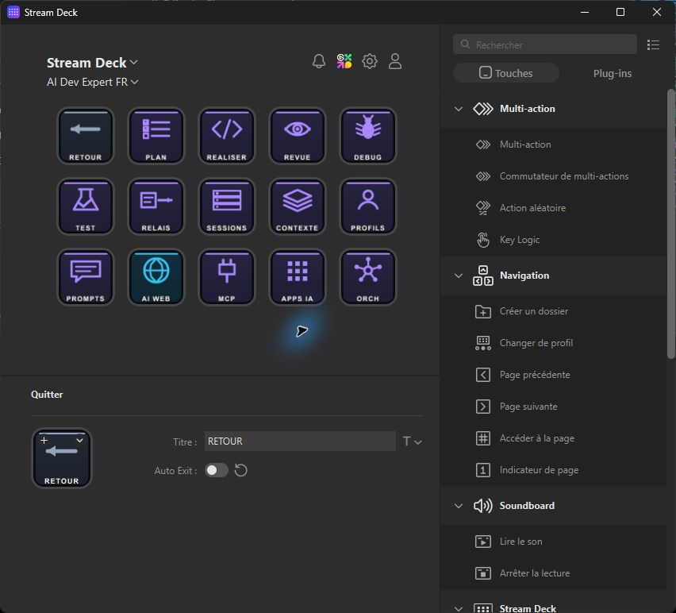
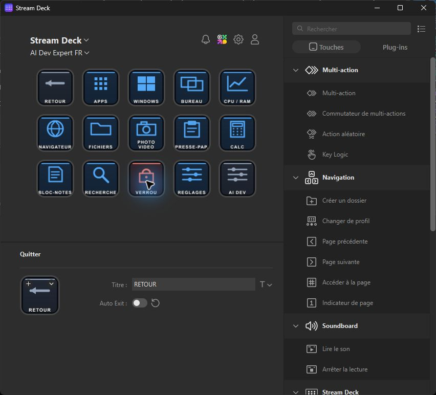
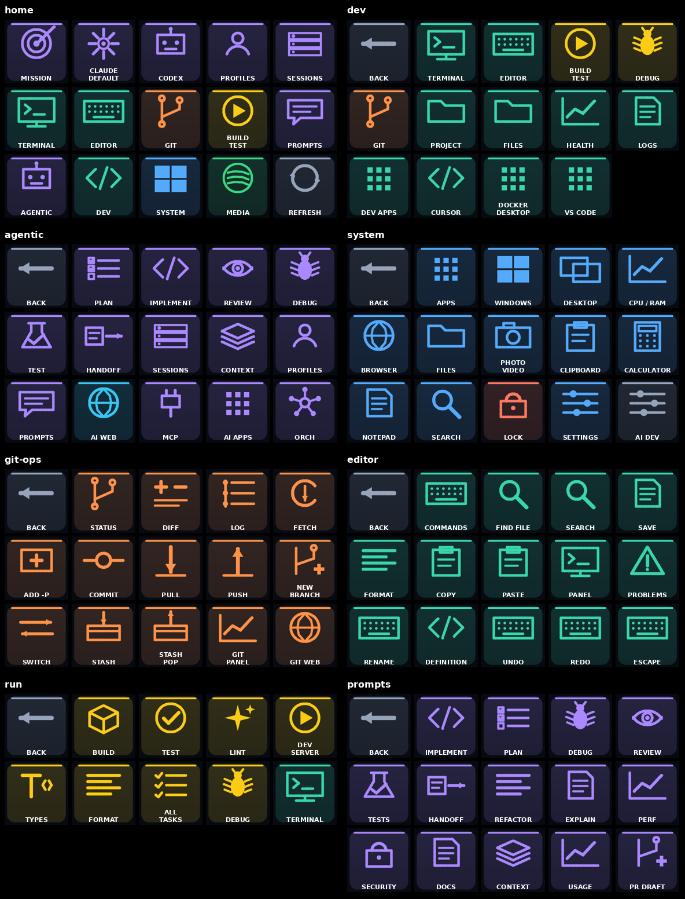

<div align="center">

# AI Dev Stream Deck

### Your AI development cockpit, one key away.

Run agents. Switch profiles. Ship code. Control Windows. Stay in flow.

[](https://github.com/JacquesGariepy/ai-dev-stream-deck/actions/workflows/tests.yml)


[](LICENSE)



**Local-first · Bilingual UI · English agent protocol · No launcher API key**

[Get started](#launch-in-60-seconds) · [Explore the cockpit](#the-cockpit) · [Button map](docs/BUTTONS.md) · [First run](docs/FIRST-RUN.md)

</div>

---

## 🚀 One deck. Your entire development loop.

AI Dev turns an Elgato Stream Deck into a dynamic command center for AI-first engineering on Windows. It discovers the tools already installed on the workstation and builds a profile around them.

| Launch agents | Build and ship | Control the workstation |
|---|---|---|
| Codex, Claude Code, AGY and other registered CLIs | Git, tests, lint, builds, dev servers and editor actions | Apps, terminals, browsers, desktops, monitors, capture and media |
| Work and personal PowerShell profiles | Plan, implement, review, debug, test and handoff workflows | CPU/RAM diagnostics, files, clipboard, search and settings |
| Claude Desktop, ChatGPT Desktop and discovered AI apps | Sessions, context snapshots, prompts and optional orchestrators | Chrome, Edge, Firefox or Brave per context |

No orchestrator is forced on the user. Run harnesses directly, connect an existing Factory, or select another external orchestrator such as OpenClaw or AX. AI Dev stays the control surface.

## ✨ What makes it different

- **Dynamic by design.** Harnesses, named profiles, desktop apps, terminals, project tasks and MCP declarations are discovered locally.
- **Fast without being reckless.** Frequent actions are one or two presses away; missions still require an explicit launch.
- **Work and personal contexts.** Keep account wrappers and browser choices separate without moving cookies or credentials.
- **Bilingual for humans.** The interface follows Windows and supports French or English. Agent-authored instructions stay in English.
- **Local-first state.** Settings, inventories, receipts, generated profiles and shortcuts remain under `%LOCALAPPDATA%\AIDev`.
- **Portable source, personal output.** The repository is generic. Each workstation generates its own device-specific Stream Deck profile.

## 🎛️ The cockpit

### Agentic workflows



PLAN, IMPLEMENT, REVIEW, DEBUG, TEST and HANDOFF open the control panel with the matching workflow selected. The user reviews the English objective and launches it explicitly.

### Windows controls



Daily workstation controls live beside the development tools: installed apps, virtual desktops, monitor views, performance tools, screen capture, clipboard, calculator and settings.

<details>
<summary><strong>See more generated pages</strong></summary>



</details>

### A layout built for muscle memory

On the 15-key MK.2 home page:

| Row | Keys |
|---|---|
| Agentic | MISSION · three detected harnesses · SESSIONS |
| Development | TERMINAL · EDITOR · GIT · BUILD/TEST · PROMPTS |
| Navigation | AGENTIC · DEV · SYSTEM · MEDIA · REFRESH |

- Violet = agentic workflows
- Teal = development
- Orange = Git
- Yellow = build, test and debug
- Blue = Windows and system
- Green = media
- Grey = navigation
- Red = unavailable or disruptive actions

BACK remains top-left on subpages and MORE remains bottom-right. Mini, Neo, +, original, MK.2 and XL layouts preserve the same priority order as space changes.

## ⚡ Launch in 60 seconds

### 1. Clone and open

```powershell
git clone https://github.com/JacquesGariepy/ai-dev-stream-deck.git
cd ai-dev-stream-deck
python launch.py
```

The desktop panel uses only the Python standard library. A physical Stream Deck is optional.

### 2. Generate the Stream Deck profile

```powershell
pwsh -File scripts/Install.ps1 -StreamDeck
```

Import the `.streamDeckProfile` printed by the installer. It contains local shortcut paths for that workstation and device, so generated archives should never be committed or shared.

### 3. Choose the project and tools

Select a project, harness and named profile. Write mission objectives in English, choose the workflow, review the launch, then press **Launch**.

> [!TIP]
> Keep the checkout in its installed location because generated shortcuts point to it. Set `AI_DEV_POWERSHELL` when the desired profile commands live in a specific PowerShell installation.

## 🔎 Automatic local discovery

AI Dev opens PowerShell with the user's normal startup profile and inspects available commands. Discovery does not sign in, start an agent or open credential files.

| Harness | CLI discovery | Named profiles | Mission adapter |
|---|---|---|---|
| Codex | PATH and standard locations | PowerShell profile commands | Yes |
| Claude Code | PATH and standard locations | PowerShell profile commands | Yes |
| AGY | PATH and standard locations | PowerShell profile commands | Yes |
| Cursor CLI | `agent` / `cursor-agent` | PowerShell profile commands | Interactive |
| Gemini CLI, OpenCode, Aider, Copilot CLI | PATH | Registered commands | Interactive |

Functions and aliases that call `Invoke-AiProfile -Tool 'name' -ProfileName 'name'` are detected automatically. Other trusted wrappers can be registered locally in `%LOCALAPPDATA%\AIDev\profiles.local.json`:

```json
[
  {"tool": "gemini", "profile": "work", "command": "gemini-work"}
]
```

AI Dev verifies the exact command before launch. Discovery shows availability; it does not claim that an account is authenticated.

## 🛠️ Development superpowers

### Git from the deck

Status, Diff, Log, Fetch, Add `-p`, Commit, Pull `--ff-only`, confirmed Push, validated New branch, Switch, Stash and Pop run as fixed visible commands in the selected repository. There is no force-push, reset or branch deletion action.

### Project-aware tasks

BUILD, TEST, LINT, DEV, TYPES and FORMAT use the matching task discovered in the selected project. If no match exists, AI Dev opens the task list instead of inventing a command.

### Every terminal on the workstation

The terminal chooser detects CMD, Windows PowerShell, PowerShell 7, Git Bash, Windows Terminal, WSL distributions and common optional terminal apps. It opens supported shells in the selected project and remembers the last choice locally.

### Browser choice per context

Web actions can use installed Chrome, Edge, Firefox or Brave. **Ask before each opening** is the default, so work and personal contexts can choose different browsers. AI Dev uses existing browser sessions; it never moves cookies or signs in for the user.

## 🔌 MCP-aware, without pretending

AI Dev inventories declarations from known Codex, Claude Desktop, Claude Code, Cursor, VS Code, Windsurf, selected-project and user-added configuration files. It creates paginated inspection keys without retaining server arguments, URLs, headers or environment variables.

Inventory means **declared**, not connected. AI Dev does not start those MCP servers or claim their tools work.

### Optional official Elgato MCP bridge

```powershell
pwsh -File scripts/Install.ps1 -ElgatoMcp
```

This installs the pinned official `@elgato/mcp-server@0.1.7` under private app data for new Codex and Claude sessions launched through AI Dev. Enable **MCP Deck** in Stream Deck and choose which virtual-deck actions to expose. Physical profile actions are not exposed automatically.

## 🧠 Bring your own orchestrator

The default is **None**. The optional orchestrator selector supports:

- **Factory (external):** connect an existing `agentic-sdlc-factory` installation.
- **Custom:** open a dashboard URL or launch an executable with explicit arguments.
- **None:** use installed harnesses directly.

The repository does not bundle Factory, OpenClaw, AX or another orchestrator. Generic integrations expose the external tool; they do not invent task, token, cost or agent telemetry.

<details>
<summary><strong>Factory adapter details</strong></summary>

When selected, the Factory adapter starts or reuses its loopback workbench and opens it through the browser chooser. It verifies package identity, avoids unrelated services, binds to `127.0.0.1`, and reads canonical status through Factory's own interface. AI Dev does not bypass readiness, create canonical tasks from ordinary missions or start autonomous runs by itself.

</details>

## 🔒 Privacy and runtime evidence

AI Dev keeps preferences, inventories, mission receipts, context snapshots, bridge dependencies and generated Stream Deck files outside the repository in `%LOCALAPPDATA%\AIDev`. Set `AI_DEV_DATA_DIR` to override the location, but do not point it inside a repository that will be published.

Sessions record observed process states such as prepared, running, exited, interrupted or launch error. They do not claim that an objective succeeded, and token or cost usage remains unmeasured. Git snapshots contain status, diff statistics and recent commit subjects, not source contents.

The panel exposes real diagnostics for tool/profile availability, data-directory access, configured MCP files, Git state and private logs. Detection does not read credentials or prove sign-in. See [engineering priorities](docs/ENGINEERING.md) for the evidence standard used by the project.

<details>
<summary><strong>Migration and troubleshooting</strong></summary>

AI Dev migrates legacy `%LOCALAPPDATA%\AI Dev` data into `%LOCALAPPDATA%\AIDev` once without overwriting existing destination files. Generate and import a fresh deck profile after migration because old imported profiles retain their previous shortcut paths.

Run the migration explicitly with:

```powershell
python scripts/migrate_data.py
```

Private logs are stored in `%LOCALAPPDATA%\AIDev\logs\aidev.log`. **Sessions** opens without PowerShell discovery, allowing recorded evidence to remain accessible when a startup profile or harness fails.

</details>

## ✅ Requirements

- Windows
- Python 3.11+ with Tk
- PowerShell 7 for mission launches
- An installed AI CLI for AI sessions
- Elgato Stream Deck software and hardware only for physical-key control
- Node.js 18+ and npm only for the optional Elgato MCP bridge

The 15-key MK.2 layout is verified on hardware. Other supported grids are generated and audited automatically; use `python scripts/stream_deck.py --grid COLSxROWS` for an unlisted device.

## 🧪 Quality gates

```powershell
python -m unittest discover -s tests -v
python scripts/export_public.py ..\ai-dev-stream-deck-source.zip
```

Public CI runs the offline suite on Windows. The exporter uses an allowlist, includes the documentation images, and scans selected files for common secret formats and user-specific Windows paths. It excludes Git history, credentials, local profiles, missions, device archives and workstation inventories.

Automated scanning is a guardrail, not proof that every possible secret format has been found. Review the export before publishing it.

## 📚 Documentation

- [First-run behavior](docs/FIRST-RUN.md)
- [Complete button map](docs/BUTTONS.md)
- [Engineering priorities](docs/ENGINEERING.md)
- [Contributing](CONTRIBUTING.md)
- [Security policy](SECURITY.md)

---

<div align="center">

Built for developers who want their AI tools at their fingertips without giving up control.

**MIT licensed.**

</div>
