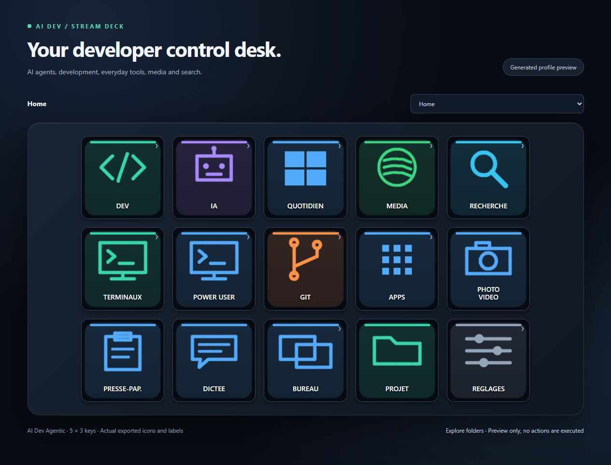
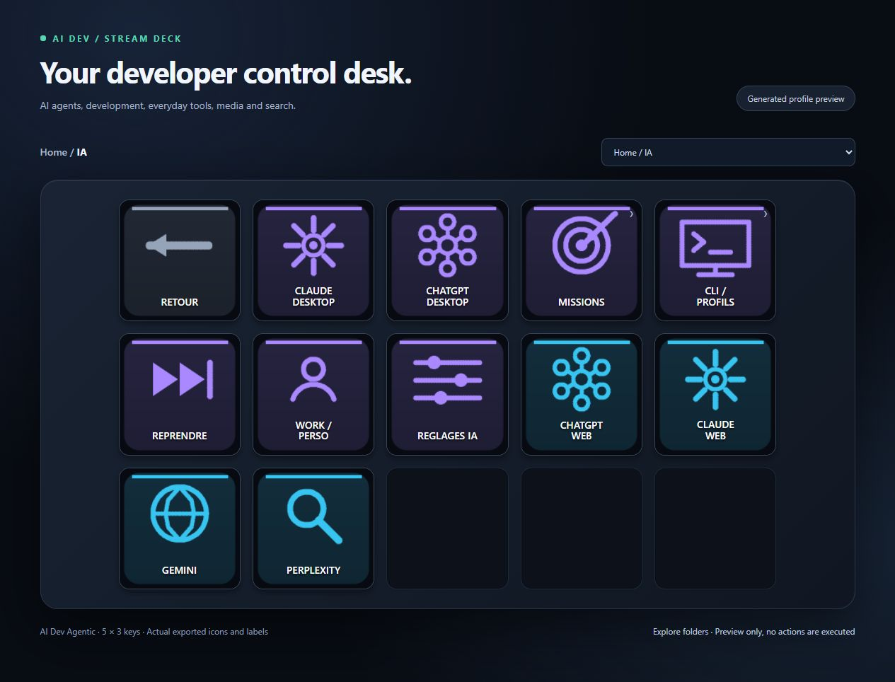
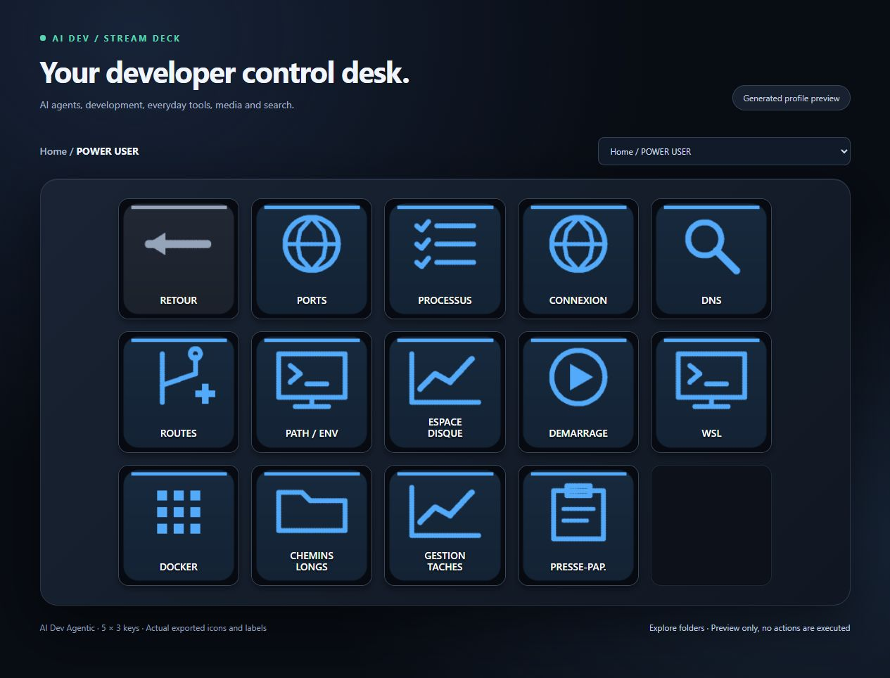

<div align="center">

# AI Dev Stream Deck

### Your whole developer desk. At your fingertips.

**Code. Ask AI. Search. Capture. Control Windows. Keep your tools close.**

[](https://github.com/JacquesGariepy/ai-dev-stream-deck/actions/workflows/tests.yml)


[](LICENSE)



**Local tools · English / French UI · Your AI accounts · Your browser choice**

<sub>Preview generated from the actual profile's icons and labels.</sub>

[Get started](#get-started) · [Explore the desk](#five-spaces-one-desk) · [Button guide](docs/CONTROL-PANEL.md) · [Contribute](CONTRIBUTING.md)

</div>

---

## Five spaces. One desk.

| Development | AI | Everyday | Media | Search |
|---|---|---|---|---|
| Git, builds, tests, lint, editors and debuggers | Claude, Codex, AGY, desktop AI apps and contextual workflows | Windows, files, clipboard, dictation, desktops and monitors | Spotify, playback, volume, screenshot and video | Google, Bing, DuckDuckGo, GitHub, Stack Overflow, YouTube and Perplexity |
| Docker, Postman and other installed tools | Exact work, personal or custom profiles | Real Task Manager, resources and performance tools | Installed media apps and YouTube | Your choice of Chrome, Edge, Firefox or Brave |

The home page puts these five areas first. The remaining keys reach terminals, Power User diagnostics, Git, installed apps, capture, clipboard history, dictation, desktops, project selection and preferences.

Every workstation builds its own profile. Installed applications are organized into short alphabetic sections, with useful development, communication and media apps featured near the front. No workstation paths or inventories ship in the source repository.

## AI that starts with context

**FIX** opens a compact task sheet containing the project, exact agent/account and error or code to work on. Review the context and start the task. The agent receives the English objective and project context in a session you can continue.

- Copy an error → **Fix** or **search online**.
- Copy code → **Explain**.
- Inspect your work → **Review**, **Plan**, **PR draft** or **Handoff**.
- Run tests directly in **Dev**, or request diagnosis and repair in **AI**.
- Open **CLI / Profiles** for an exact installed account, including custom profiles and other detected harnesses. Harnesses without a task adapter open interactively.

An empty task is refused. The launcher loads your real PowerShell profiles, preserves multiline input and quotes, and never silently substitutes another account. The CLI's authentication, repository trust and permission prompts remain in effect.



> A terminal is a working agent session, not evidence of a completed task. Local receipts record observed launch/errors; they do not invent success or token usage.

## Git stays where you work

**STATUS, DIFF, LOG and the other Git keys run in the PowerShell terminal you are already using, in its current directory.** No new terminal opens, and no saved project setting changes that location.

The `AIDevTerminal` module handles the keys at an empty PowerShell prompt. If you have already typed something, it leaves that input intact. Push, stage, branch creation/switching, stash and stash apply ask for confirmation in that session. Fetch runs directly; pull runs directly with `--ff-only`. This integration supports Windows PowerShell 5.1 and PowerShell 7; it is not a CMD or Bash integration.

## Windows controls you actually use

Clipboard history. Voice dictation. Snap layouts. Move a window to the other monitor. Switch desktops. Open display, audio or Bluetooth settings. Capture a screenshot or video. Inspect CPU, memory, disk and network activity using Windows tools.

Common keyboard actions are native Stream Deck hotkeys, following [Microsoft's Windows shortcuts](https://support.microsoft.com/en-us/windows/keyboard-shortcuts-in-windows-dcc61a57-8ff0-cffe-9796-cb9706c75eec). The deck does not start an AI session to change the volume or open Calculator.

### The commands you never remember

**Power User** opens readable diagnostics directly in a terminal:

| Question | Key |
|---|---|
| What is using this port? | TCP listeners with process names and IDs |
| Can I reach this service? | Host and TCP port test |
| Is it DNS or routing? | DNS lookup, IP configuration, routes and DNS servers |
| Why is this command missing? | PATH entries, missing directories and duplicates |
| Who started this process? | Process and parent IDs |
| What starts with Windows? | Startup program inventory |
| How are WSL and Docker doing? | Distribution status, containers and a resource snapshot |
| Is disk space or a path limit the problem? | Volume usage and Windows/Git long-path settings |

These commands inspect your machine. They do not kill processes, reset networking or change Windows settings. Missing tools and access errors are reported explicitly.



## Search without losing your browser context

Search keys can preload the clipboard into a query sheet. Check the text, choose a browser and open the results. Work and personal profiles can remember different browsers. Nothing signs you in, moves cookies or submits clipboard text automatically.

Direct links include AI services, GitHub pull requests and issues, MDN, Microsoft Learn, npm and PyPI.

## Get started

Requirements: Windows, Stream Deck software, Python 3.11+, and PowerShell. PowerShell 7 is recommended for agent sessions. AI features require an installed supported CLI and your existing account.

```powershell
git clone https://github.com/JacquesGariepy/ai-dev-stream-deck.git
cd ai-dev-stream-deck
python scripts/agent_deck.py --install --enable-shell
```

Select **AI Dev Agentic** in Stream Deck. The installer briefly restarts Stream Deck, backs up the previous generated profile and updates it without creating numbered copies. Mini, Neo, +, original, MK.2 and XL grids are generated and audited; use `--device-id` when several devices are configured.

Use **Settings → Preferences** for your project, language, agent, profile and browser. Use **Re-scan** after installing tools or changing the deck language.

`--enable-shell` installs the `AIDevTerminal` module and a loader in your PowerShell profiles, with backups. In a terminal that was already open, activate it once:

```powershell
Import-Module AIDevTerminal
```

New sessions load it automatically. **Settings → Terminal setup** can install it again and copy the activation command. Focus a PowerShell prompt before pressing a Git key.

To generate an archive for manual import instead:

```powershell
python scripts/agent_deck.py --no-import
```

## Your machine. Your accounts.

Wrappers such as `claude-work`, `claude-personal`, `codex-work` and `agy-personal` are discovered from PowerShell. Each detected profile gets its own button, grouped by tool. Choose `default` explicitly for a base CLI. Contextual task adapters currently cover Claude, Codex and AGY.

The runtime lives under `%LOCALAPPDATA%\AIDev\agentdeck`, with no space in the app directory. Packaged-app generation resolves physical Windows paths so shortcuts point to files Explorer can read. Set `AI_DEV_AGENTDECK_DIR` or `--data-dir` to choose another private location.

Task templates live in the installed `intents.json`. The interface supports French and English; AI objectives and communication use English. No orchestrator is bundled or required.

## Execution and privacy

- Native keys act directly; task keys use small PowerShell scripts. No Classic AI Dev window opens between a key and its action.
- The agent's permission checks remain active. Prompts forbid remote publishing; they are not a network firewall.
- Push, stage, branch creation/switching, stash and stash apply ask for confirmation. Fetch and fast-forward-only pull run directly.
- Search text and AI context are reviewable before submission.
- Installed apps, device IDs, account selections, temporary requests and failure output remain private.
- CLI profile selection does not change the account inside a desktop application.

The optional Classic Python application remains available with `python launch.py` for its visual inventories and external-orchestrator adapters. The physical profile uses the direct runtime.

## Built to be checked

```powershell
python -m unittest discover -s tests -v
python scripts/export_public.py ..\ai-dev-stream-deck-source.zip
```

Tests cover generated navigation, native Windows shortcuts, exact argument delivery, account isolation, task detection, Git operations in temporary repositories and encoded search queries. Profile audits check every key and icon. Public CI runs on Windows. An audit verifies wiring; it does not claim every external app or AI account was exercised.

The export uses a source allowlist and scans common secret patterns. Generated profiles, private state, backups and local inventories are excluded.

---

[Control panel guide](docs/CONTROL-PANEL.md) · [Profiles and integrations](docs/RECOMMENDED-INTEGRATIONS.md) · [Classic button map](docs/BUTTONS.md) · [Engineering](docs/ENGINEERING.md) · [Security](SECURITY.md)

<div align="center">

**A developer desk that fits the tools you already use. MIT licensed.**

</div>
